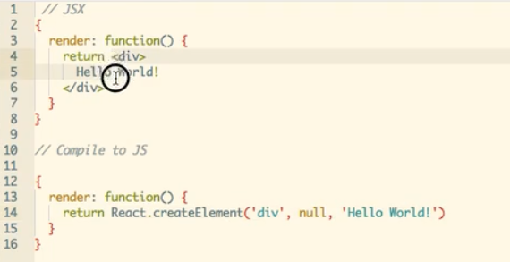

[Give it five minutes](https://signalvnoise.com/posts/3124-give-it-five-minutes)

#### React + Flux

##### Why React?
- React is a Javascript Library.
- React helps in building large application with the data changing overtime.
- When data changes react simple hit "refresh" button and only update the changed parts.
- React is all about building reusable components.

##### Why Flux?

##### What is JSX?

JSX Extenstion of Javascript. It allows you to write HTML inside your Javascript code. JSX must first be compiled from JSX to Javascript.

##### Example of Static Component
- [Static Component](\index.html)

##### Example of Dynamic Component
- [Dynamic Component](\badge.html)

##### Example of Nested Component
- [Nested Component](\nested.html)

##### Example of rendering List of Components
- [Thumbnail List](\thumbnail-list.html)

